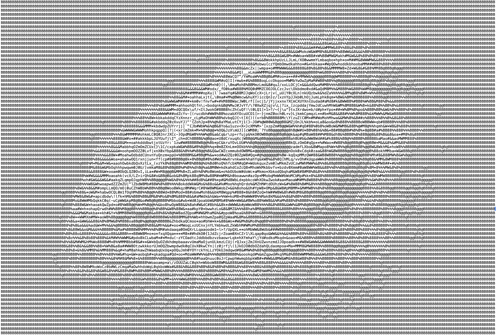
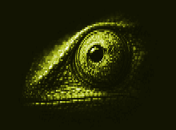
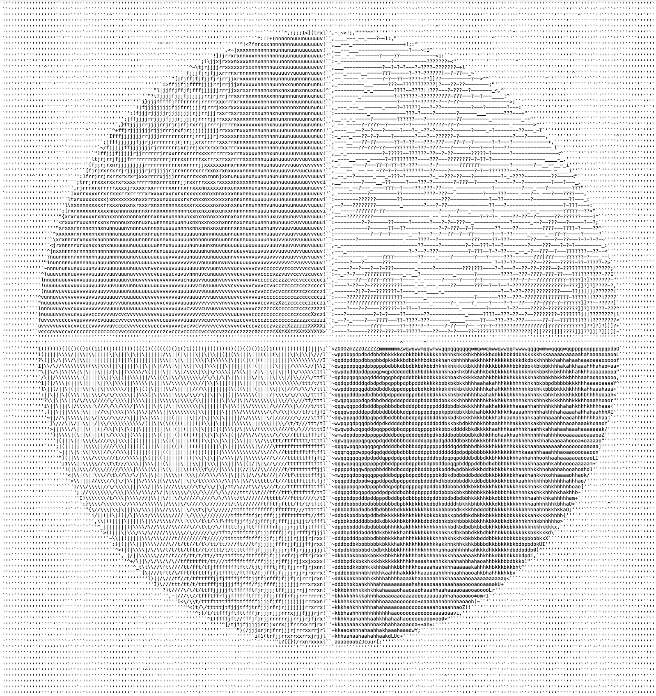
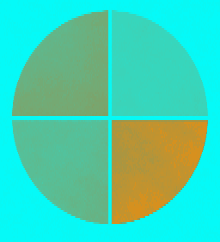
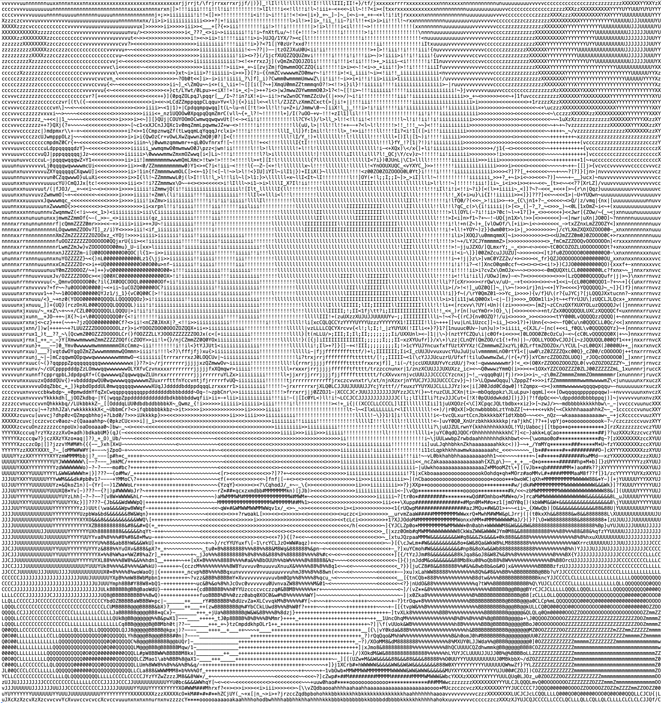
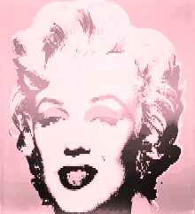
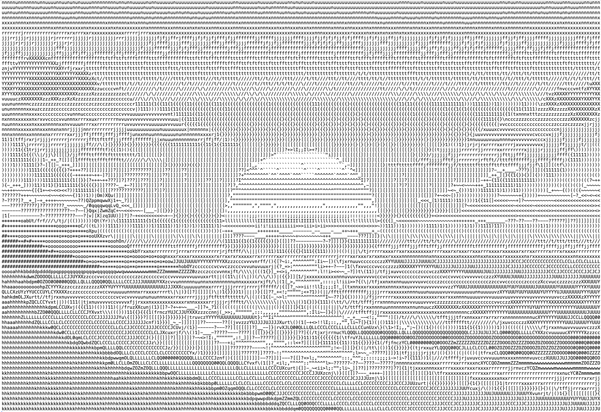
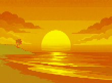
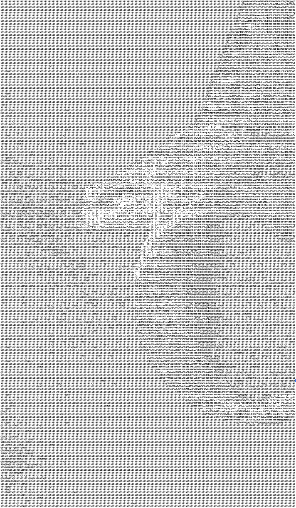
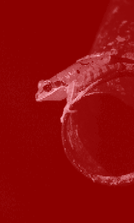

<div align="center">

# ASCII Tonal Image Generator

**Turning the tonal structure of ASCII art into coloured raster images.**


</div>

```text
  shadows ──────────────────────────────────────────────────────────────────────────── highlights
  $RgH@B%8E&WNM#D*oa4F3e2Vhk5bAdG96pqKwmZO0QLCyJUSYsXPzcvuTnxrjft/\|(=)1{}[]?-_+~<>i!l7I;:,"^`'. 
```

ASCII artists build light and shadow out of keyboard characters: a dense `$` or `@` reads as dark, a sparse `.` or a blank space reads as light. This program reads that tonal logic back out of a text file. It ranks every character on the 95-step density ramp above, maps each step to a colour from a one-, two- or three-colour palette you choose, and writes the result as a pixel image in the plain-text **PPM (P3)** format.

The ASCII Tonal Image Generator is a Python program created for the University Course CPS109 Project. It bridges symbolic text-based visual encoding and structured pixel-based image representation using only fundamental Python constructs, and it sits where my background in photography meets my interest in computational systems.

<div align="center">

[Gallery](#gallery) · [Features](#features-and-colour-systems) · [How it works](#how-it-works) · [Getting started](#getting-started) · [Project structure](#project-structure) · [Limitations](#limitations-and-next-steps)

</div>

---

## Gallery

Five sample artworks from [`ascii_example_art/`](ascii_example_art/), each shown beside an image the program generated from it.

> GitHub can't display `.ppm` files, so the images below are **PNG previews** from [`documentation/preview/`](documentation/preview/). The program's actual outputs are the linked `.ppm` files in [`image_outputs/`](image_outputs/).

<table>
  <tr><th colspan="2">Chameleon</th></tr>
  <tr>
    <td align="center" width="50%"><sub><b>ORIGINAL ASCII</b></sub></td>
    <td align="center" width="50%"><sub><b>GENERATED IMAGE</b></sub></td>
  </tr>
  <tr>
    <td width="50%"></td>
    <td width="50%"></td>
  </tr>
  <tr>
    <td align="center"><sub><a href="ascii_example_art/ascii-art-chameleon.txt"><code>ascii-art-chameleon.txt</code></a> · 220 × 81 characters</sub></td>
    <td align="center"><sub><a href="image_outputs/chameleon.ppm"><code>chameleon.ppm</code></a> · 220 × 162 pixels</sub></td>
  </tr>

  <tr><th colspan="2">Geometric Circle</th></tr>
  <tr>
    <td align="center"><sub><b>ORIGINAL ASCII</b></sub></td>
    <td align="center"><sub><b>GENERATED IMAGE</b></sub></td>
  </tr>
  <tr>
    <td></td>
    <td></td>
  </tr>
  <tr>
    <td align="center"><sub><a href="ascii_example_art/ascii-art-geometric-circle.txt"><code>ascii-art-geometric-circle.txt</code></a> · 220 × 121 characters</sub></td>
    <td align="center"><sub><a href="image_outputs/circle.ppm"><code>circle.ppm</code></a> · 220 × 242 pixels</sub></td>
  </tr>

  <tr><th colspan="2">Marilyn Monroe</th></tr>
  <tr>
    <td align="center"><sub><b>ORIGINAL ASCII</b></sub></td>
    <td align="center"><sub><b>GENERATED IMAGE</b></sub></td>
  </tr>
  <tr>
    <td></td>
    <td></td>
  </tr>
  <tr>
    <td align="center"><sub><a href="ascii_example_art/ascii-art-marilyn-monroe.txt"><code>ascii-art-marilyn-monroe.txt</code></a> · 220 × 121 characters</sub></td>
    <td align="center"><sub><a href="image_outputs/marilyn.ppm"><code>marilyn.ppm</code></a> · 220 × 242 pixels</sub></td>
  </tr>

  <tr><th colspan="2">Sunset</th></tr>
  <tr>
    <td align="center"><sub><b>ORIGINAL ASCII</b></sub></td>
    <td align="center"><sub><b>GENERATED IMAGE</b></sub></td>
  </tr>
  <tr>
    <td></td>
    <td></td>
  </tr>
  <tr>
    <td align="center"><sub><a href="ascii_example_art/ascii-art-sunset.txt"><code>ascii-art-sunset.txt</code></a> · 220 × 81 characters</sub></td>
    <td align="center"><sub><a href="image_outputs/sunset.ppm"><code>sunset.ppm</code></a> · 220 × 162 pixels</sub></td>
  </tr>

  <tr><th colspan="2">Tree Frog</th></tr>
  <tr>
    <td align="center"><sub><b>ORIGINAL ASCII</b></sub></td>
    <td align="center"><sub><b>GENERATED IMAGE</b></sub></td>
  </tr>
  <tr>
    <td></td>
    <td></td>
  </tr>
  <tr>
    <td align="center"><sub><a href="ascii_example_art/ascii-art-treefrog.txt"><code>ascii-art-treefrog.txt</code></a> · 220 × 182 characters</sub></td>
    <td align="center"><sub><a href="image_outputs/froggy.ppm"><code>froggy.ppm</code></a> · 220 × 364 pixels</sub></td>
  </tr>
</table>

---

## Why I built it

ASCII art is one of the older forms of digital image-making. Artists simulate light, shadow and texture by choosing how much "ink" each character carries. The results are expressive, but they live as text: they depend on a monospaced font, they carry no colour, and they don't fit into the pixel-based tools most people use to edit and share images.

This project asks a simple question: **if a character already encodes a tone, can that tone be read back out and rendered as colour?** It answers by defining and implementing a deterministic system that translates ASCII character-based tonal density into scaled RGB pixel data. Each character is ranked by visual density, that rank becomes a position along a colour gradient, and each character becomes a pixel. The same input and the same colour choices always produce the same image.

The idea came from photography, where images are thought about in terms of tonal range, which is exactly how the program asks for its colours: shadows, midtones and highlights. On the programming side, it was a well-contained problem that exercises parsing, validation, arithmetic and file output using nothing beyond the Python standard library.

---

## Features and colour systems

| Feature | What it does |
|---|---|
| **Sample or custom artwork** | Pick one of five included artworks from a menu, or supply your own `.txt` file. |
| **Dimension check** | Confirms every line matches the width of the first and reports the rows that don't. |
| **Full printable-ASCII ramp** | All 95 printable ASCII characters, from `$` to space, have a tonal position. |
| **Three colour systems** | Mono Tone, Duo Tone and Tri Tone palettes spread across the whole ramp. |
| **Named colour lookup** | Choose colours by name from a CSV colour dataset, with a paginated partial-match search. |
| **Direct RGB entry** | Enter red, green and blue values when a search finds no matching colour names. |
| **Aspect correction** | Each text row is written twice to approximate the tall proportions of text characters. |
| **PPM output** | Writes `image_outputs/<name>.ppm` using the name you give at the start. |

| Colour system | Colours you choose | Gradient, densest → lightest |
|---|---|---|
| **Mono Tone** | 1 | black → **your colour** → white |
| **Duo Tone** | 2: shadows, highlights | **shadows** → **highlights** in one continuous blend |
| **Tri Tone** | 3: shadows, midtones, highlights | **shadows** → **midtones** → **highlights** |

Mono Tone and Tri Tone split the ramp at its centre character (`S`), which holds the pure chosen colour or midtone.

**Choosing a colour.** Type a colour name (case-insensitive). If it exactly matches a name in [`color_names_kaggle.csv`](documentation/color_dataset/color_names_kaggle.csv), it's used. If not, every name *containing* your text is listed five at a time: enter a number to choose one, or `n` for the next page. If nothing matches, you can retry, enter an RGB value directly (values above 255 are capped), or give up.

---

## How it works

```text
  start ─▶ name output ─▶ choose sample or custom .txt ─▶ read + check row lengths
                                                                   │
  write image_outputs/<name>.ppm ◀─ map characters to RGB ◀─ build palette ◀─ choose colour system + colours
```

The script runs as eight numbered stages called in order by a single main function, `pixelize_ascii()`. The file, validation and colour stages return `None` on failure or cancellation, and the main function stops cleanly when they do.

<details>
<summary><b>The character-density ramp</b></summary>

<br>

Tone comes from a fixed string ordered from the densest character to the lightest:

```python
character_ramp = "$RgH@B%8E&WNM#D*oa4F3e2Vhk5bAdG96pqKwmZO0QLCyJUSYsXPzcvuTnxrjft/\\|(=)1{}[]?-_+~<>i!l7I;:,\"^`'. "
```

A character's index is its tone: `0` (`$`) is the deepest shadow and `94` (space) is the brightest highlight.

The ramp builds on **Paul Bourke's 70-character greyscale ramp** from [*Character representation of grey scale images*](https://paulbourke.net/dataformats/asciiart/). Bourke's ramp omits 25 printable characters (`2`–`7`, `9`, `=`, `A D E F G H K N P R S T V` and `e g s y`). To cover them, each glyph's ink coverage was measured in four common monospace fonts (DejaVu Sans Mono, Liberation Mono, FreeMono and Latin Modern Mono), and each missing character was inserted beside the original character with the closest average coverage. Bourke's 70 characters keep their original order.

</details>

<details>
<summary><b>Building a palette</b></summary>

<br>

Each colour system loops over the ramp and stores one `[r, g, b]` list per character in a dictionary. Duo Tone is the simplest: it starts at the shadow colour and adds an equal share of the difference between the two colours at every step.

```python
for i in range(n_steps):
    if i == 0:
        r_code = color_one[0]
        g_code = color_one[1]
        b_code = color_one[2]
    else:
        r_code += (color_two[0] - color_one[0]) / (n_steps - 1)
        g_code += (color_two[1] - color_one[1]) / (n_steps - 1)
        b_code += (color_two[2] - color_one[2]) / (n_steps - 1)

    color_range[character_ramp[i]] = [int(r_code),int(g_code),int(b_code)]
```

Mono Tone and Tri Tone use the same accumulating approach on each half of the ramp, splitting at `n_steps // 2`, with separate branches for even- and odd-length ramps. Each red, green and blue channel is interpolated independently.

</details>

<details>
<summary><b>Validation, aspect correction and the PPM file</b></summary>

<br>

The text is split into lines. Width is the length of the first line, and every other line must match it. Each character then becomes one pixel, and each row is written twice because text characters are roughly twice as tall as they are wide:

```python
for row in ascii_string.splitlines():
    for i in range(2):          # print each line twice to make up for text height
        for pixel in row:
            if pixel in ascii_colors.keys():
                ppm_output_str += f"{ascii_colors[pixel][0]} {ascii_colors[pixel][1]} {ascii_colors[pixel][2]} "
        ppm_output_str += "\n"
```

A *W* × *H* character artwork becomes a *W* × 2*H* pixel image. **P3 PPM** is plain text: a three-line header (format, dimensions, maximum value) followed by RGB triples. PPM was chosen because:

- It requires no external libraries.
- It can be written using plain text file output.
- It clearly demonstrates understanding of structured file formatting.

Here is a two-line artwork (`$.` over ` $`) rendered with a black-to-white Duo Tone:

```text
P3
2 4
255
0 0 0 251 251 251
0 0 0 251 251 251
254 254 254 0 0 0
254 254 254 0 0 0
```

</details>

### Technical features demonstrated (CPS109 requirements)

This project demonstrates all required Python constructs:

| Construct | Where it appears |
|---|---|
| **Variable declarations and assignments** | Throughout, from prompt responses to running RGB values |
| **Arithmetic expressions** | RGB interpolation, midpoint and pagination calculations |
| **`if` / `elif` / `else` conditionals** | Menu branching and the even/odd, before/after-midpoint palette logic |
| **Sequence types** (strings, lists, tuples) | The character ramp, RGB lists, sample file names, multi-value returns |
| **Nested `for` loops** | ASCII parsing and pixel generation (row → repeat → character) |
| **`while` loops** | Input validation, colour search and pagination |
| **User-defined functions** | Eight functional stages plus the `pixelize_ascii()` main function |
| **Print statements for program interaction** | The guided prompts, error messages and output summary |
| **File input** | Reading the ASCII `.txt` artwork and the `.csv` colour dataset |
| **File output** | Writing the `.ppm` image |

Beyond the requirements, v3 also uses dictionaries for the colour dataset and palettes, and `try`/`except` to handle missing files.

---

## Getting started

**Requirements:** Python 3.6 or later (the script uses f-strings) and nothing else: no third-party packages and no imports. To view the results, use an image viewer that opens `.ppm` files, such as GIMP.

```bash
git clone https://github.com/Oceanpro00/ascii_tonal_image_generator.git
cd ascii_tonal_image_generator/scripts
python3 ascii_tonal_generator.py
```

> [!IMPORTANT]
> Run the script **from inside `scripts/`**. It finds the sample art (`../ascii_example_art/`), the colour dataset (`../documentation/color_dataset/`) and the output folder (`../image_outputs/`) using paths relative to the current working directory.

The program then guides you through a series of prompts:

| Prompt | Enter |
|---|---|
| Generate an artwork? | `n` to quit; anything else continues |
| File name | Any text; this becomes the output name |
| Example or own file | `0` for a sample, `1` for your own file |
| Sample number | `0` tree frog · `1` sunset · `2` chameleon · `3` geometric circle · `4` Marilyn Monroe |
| Colour system | `0` Mono · `1` Duo · `2` Tri |
| Colour(s) | A colour name, then follow the search or RGB options if needed |

**Using your own art:** place a `.txt` file in `scripts/` and type its name when asked; the `.txt` extension is optional. Every line must be the same length as the first, trailing spaces included, and the file should use printable ASCII characters only.

---

## Project structure

```text
ascii_tonal_image_generator/
├── ascii_example_art/              # Five sample ASCII inputs (.txt)
├── documentation/
│   ├── color_dataset/
│   │   └── color_names_kaggle.csv  # Colour names + RGB values read at runtime
│   ├── cps109_project_outline.pdf  # Course project outline
│   ├── ppm_examples_foundonweb/    # Reference PPM used to learn the format
│   ├── practice_and_testing/       # Early experiments: PPM writing, colour selection
│   └── preview/                    # PNG previews used in this README
├── image_outputs/                  # Generated .ppm files, including development test outputs
├── scripts/
│   ├── ascii_tonal_generator.py    # Current version (v3), the one to run
│   └── previous_versions/
│       ├── ascii_tonal_generator_v1.py
│       └── ascii_tonal_generator_v2.py
├── .gitignore
└── README.md
```

---

## Development

The program was developed independently for CPS109 over three versions.

1. **Groundwork.** Two practice scripts explored the core problems separately. `ppm_creation_playground.py` covered PPM headers and gradients, and `color_selection_and_tonal_range_trial.py` covered colour input, validation and tonal scaling.
2. **v1 and v2.** Earlier versions, kept in `scripts/previous_versions/`, scaled a single base colour across the tonal range, chosen from a small dictionary of basic colours or entered as RGB.
3. **v3 (`ascii_tonal_generator.py`).** This version turned v2's basic system into **Mono Tone**, added **Duo Tone** and **Tri Tone** as separate, swappable palette functions, moved colour lookup to a searchable CSV dataset, added custom file input, and extended the density ramp to every printable ASCII character.

All development remained within the scope of fundamental Python constructs as required for CPS109.

**Design choices.** The code uses fundamental Python only: no external libraries, a hand-parsed CSV, and an image written as plain text. A fixed ramp keeps the tonal mapping predictable, row doubling handles the aspect ratio with simple integer logic, and guided prompts keep the program approachable for people who don't program.

---

## Limitations and next steps

**Context.** This project was built alongside CPS109 assignment requirements within a one-to-two-month span, so its scope was shaped by the course. It can be iterated on further if the opportunity arises.

**Current limitations**

- **Working directory.** The script must be run from `scripts/` because every path is relative.
- **Strict input format.** Rows must be exactly equal in length and aren't padded automatically. Error messages number rows from `0`.
- **Characters outside the ramp.** Tabs and non-ASCII characters such as accented letters or Unicode block shading are skipped without warning, which leaves rows short and produces a malformed PPM.
- **Font-dependent density.** Character density varies between fonts, so the positions of the added characters are approximations based on a few common monospace fonts.
- **Fixed tonal direction.** Dense characters always map to shadows, so art made for light-on-dark terminals comes out inverted.
- **Input validation gaps.** Non-numeric menu or RGB input raises a Python error. Negative RGB values are accepted as-is. An invalid colour-system choice or a cancelled colour search ends the program without a message. Existing output files are overwritten without warning.
- **Minor precision and reporting quirks.** Gradient endpoints can land one unit short (for example `254` instead of `255`) because values are truncated with `int()`. The printed summary reports the text's height rather than the doubled image height.

**Possible next steps** (not implemented)

- Dynamic tonal ramp detection and automatic character density ranking
- PNG output using external libraries, and a GUI with colour pickers and a live preview
- A Posterize colour system, planned in the v3 development notes, using flat colour bands instead of gradients
- More forgiving input: padding uneven rows, handling tabs, and giving unknown characters a default tone
- An inverted-ramp option and adjustable vertical scaling
- Clearer validation and error messages at every prompt

PNG output, GUI-based colour selection and dynamic ramp detection were intentionally excluded to maintain assignment scope and focus on core Python constructs.

---

## Credits

- **Density ramp:** extended from Paul Bourke's greyscale character ramp, [*Character representation of grey scale images*](https://paulbourke.net/dataformats/asciiart/).
- **Colour names:** [`color_names_kaggle.csv`](documentation/color_dataset/color_names_kaggle.csv), a colour-name dataset sourced from Kaggle.

## Author

**Sean Schallberger** · CPS109 — Computer Programming I · Toronto Metropolitan University, 2026

Independently developed as first-semester Computer Science coursework. The project's creative direction draws on my BFA in Photography and my interest in integrated media and creative technology.